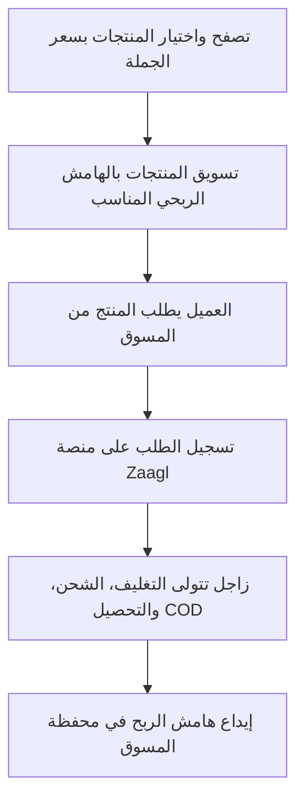

# 📦 Zaagl (زاجل) - منصة التجارة الاجتماعية والدروب شيبنج

> **زاجل (Zaagl)** هي منصة تجارة إلكترونية مصرية قائمة على نموذج **الدروب شيبنج المحلي (Local Dropshipping)** والتجارة الاجتماعية، تُمكّن الأفراد من بدء أعمالهم التجارية عبر الإنترنت بدون رأس مال وبدون الحاجة لامتلاك مخزون.

---

## 📌 نبذة عامة (Overview)

تعمل منصة **Zaagl** كحلقة وصل وسيطة وبنية تحتية لوجستية بين:

1. **الموردين والتجار:** أصحاب المنتجات والمخزون.
2. **المسوقين (البائعين):** أفراد أو أصحاب صفحات على وسائل التواصل الاجتماعي.
3. **العميل النهائي:** المشتري الذي يستلم المنتج بنظام الدفع عند الاستلام (COD).

تقوم المنصة بإلغاء جميع العقبات التشغيلية (التخزين، الشحن، التحصيل، المرتجعات) ليتفرغ البائع لعمليات **التسويق والمبيعات فقط**.

---

## ⚙️ كيف تعمل المنصة؟ (Workflow)

